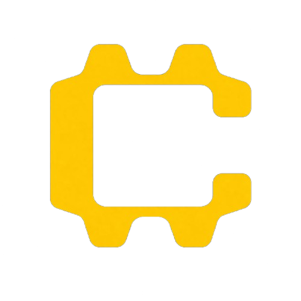

# Captar

<p align="center">
  
</p>

<p align="center">
  Runtime guardrails for AI applications. Budget limits, tool policies, and trace review before a request leaves your server.
</p>

<p align="center">
  <a href="https://github.com/8dazo/captor/actions"></a>
  <a href="LICENSE"></a>
  <a href="package.json"></a>
  <a href="package.json"></a>
  <a href="https://github.com/8dazo/captor/releases"></a>
</p>

---

## Why Captar

Modern AI apps need more than observability. They need guardrails that act **before** a request overruns budget, triggers unsafe tooling, or leaves the intended execution path.

Captar wraps your OpenAI client with budget limits, tool allowlists, and execution policies inside your application runtime. No proxy gateway. No provider key compromise. Local-first enforcement with optional platform export.

## What It Does

- **Budget guardrails** — Reserve worst-case cost before every model call, reconcile after
- **Tool tracking** — Monitor tool calls, execution time, and success rates with allowlists and blocklists
- **Policy enforcement** — Define rules locally in code or fetch them remotely from the platform
- **Trace export** — Export traces, spend events, and violations to the dashboard for review
- **Datasets & evals** — Build evaluation datasets from traces, run manual scoring with weighted rubrics
- **Minimal integration** — Single wrapper call around an existing OpenAI client

## Architecture

```
┌─────────────┐     ┌─────────────┐     ┌──────────────┐
│   Client    │────>│   OpenAI    │────>│   Captar     │
│   Request   │     │   Client    │     │   Runtime    │
└─────────────┘     └─────────────┘     └──────┬───────┘
                                                │
                ┌───────────────────────────────┼───────────┐
                │                               │           │
                ▼                               ▼           ▼
         ┌──────────┐                 ┌──────────┐ ┌──────────┐
         │  Budget  │                 │  Policy  │ │  Tool    │
         │  Reserve │                 │   Eval   │ │  Track   │
         └──────────┘                 └──────────┘ └──────────┘
                │                               │           │
                ▼                               ▼           ▼
         ┌──────────┐                 ┌──────────┐ ┌──────────┐
         │  Trace   │                 │  Spend   │ │  Export  │
         │  Span    │                 │  Ledger  │ │  Events  │
         └──────────┘                 └──────────┘ └──────────┘
                │
                ▼
         ┌──────────────┐
         │   Captar     │
         │   Platform   │
         │ (Dashboard)  │
         └──────────────┘
```

## Quick Start

```bash
# Clone the repo
git clone https://github.com/8dazo/captor.git
cd captar

# Install dependencies
pnpm install

# Configure environment
cp .env.example .env
# Edit .env with your database URL and auth secret

# Set up database
pnpm db:generate
pnpm db:push
pnpm db:seed

# Start all apps
pnpm dev
```

**App URLs:**

- Platform: http://localhost:3000
- Marketing site: http://localhost:3001

## SDK Usage

```typescript
import { wrapOpenAI } from '@captar/sdk';

const client = wrapOpenAI(openai, {
  sessionId: 'session_123',
  budget: { maxSpendCents: 10000 },
  tools: { allowed: ['search', 'calculate'] },
});

const completion = await client.chat.completions.create({
  model: 'gpt-4',
  messages: [{ role: 'user', content: 'Hello' }],
});
```

## Repository Structure

```
captor/
├── apps/
│   ├── platform/           # Next.js 15 — traces, datasets, evals, auth
│   ├── marketing/          # Next.js 15 — landing, docs, pricing, blog
│   └── site/               # Reserved for future release
├── packages/ts/
│   ├── sdk/                # Core TypeScript runtime SDK
│   ├── types/              # Shared public types
│   ├── config/             # Pricing, defaults, env helpers
│   ├── utils/              # Utility helpers
│   └── ui/                 # Shared UI primitives
├── packages/rust/
│   ├── core/               # Rust core runtime (WIP)
│   ├── cli/                # Rust CLI (WIP)
│   └── bindings/           # Platform bindings (WIP)
├── db/
│   └── prisma/
│       ├── schema.prisma   # Database schema
│       └── migrations/     # Migration files
├── infra/                  # Infrastructure assets
├── demo/                   # Live demo scripts
└── docs/                   # Plans and ADRs
```

## Tech Stack

| Layer      | Technology                   |
| ---------- | ---------------------------- |
| Framework  | Next.js 15 (App Router)      |
| Language   | TypeScript 5, Rust           |
| Styling    | Tailwind CSS 3, shadcn/ui    |
| Database   | PostgreSQL 14+, Prisma ORM   |
| Auth       | NextAuth.js v5               |
| Monorepo   | pnpm workspaces, Turborepo   |
| Testing    | Vitest                       |
| Formatting | Prettier, lint-staged, Husky |

## Requirements

- Node.js 20+
- pnpm 10+
- PostgreSQL 14+
- Rust 1.70+ (for CLI tools)

## Available Commands

```bash
# Development
pnpm dev                  # Start all apps
pnpm --filter @captar/platform dev  # Platform only
pnpm --filter marketing dev         # Marketing only

# Build
pnpm build                # Build all packages and apps

# Database
pnpm db:generate          # Generate Prisma client
pnpm db:push              # Push schema changes
pnpm db:seed              # Seed with demo data

# Code Quality
pnpm lint                 # TypeScript check across workspace
pnpm format               # Format with Prettier
pnpm test                 # Run all tests

# Demo
pnpm demo:live            # Live OpenAI demonstration
```

## Contributing

We welcome contributions. Please read [CONTRIBUTING.md](CONTRIBUTING.md) for:

- Development setup instructions
- Branch naming conventions
- Commit message format
- Pull request process
- Testing guidelines

## Development

For detailed development guides, see [DEVELOPMENT.md](DEVELOPMENT.md).

## Security

For security issues, please email **security@captar.local** instead of opening a public issue.
See [SECURITY.md](SECURITY.md) for our security policy and responsible disclosure process.

## Code of Conduct

This project adheres to the [Contributor Covenant](CODE_OF_CONDUCT.md). By participating, you are expected to uphold this code.

## Support

- Documentation: [captar.aurat.ai/docs](https://captar.aurat.ai/docs)
- Issues: [GitHub Issues](https://github.com/8dazo/captor/issues)
- Contact: [captar.aurat.ai/contact](https://captar.aurat.ai/contact)

## License

Apache License 2.0. See [LICENSE](LICENSE) for details.

---

<p align="center">
  <sub>Built with care by the Captar team.</sub>
  <br />
  <a href="https://captar.aurat.ai">captar.aurat.ai</a> ·
  <a href="https://github.com/8dazo/captor">GitHub</a> ·
  <a href="LICENSE">License</a>
</p>
